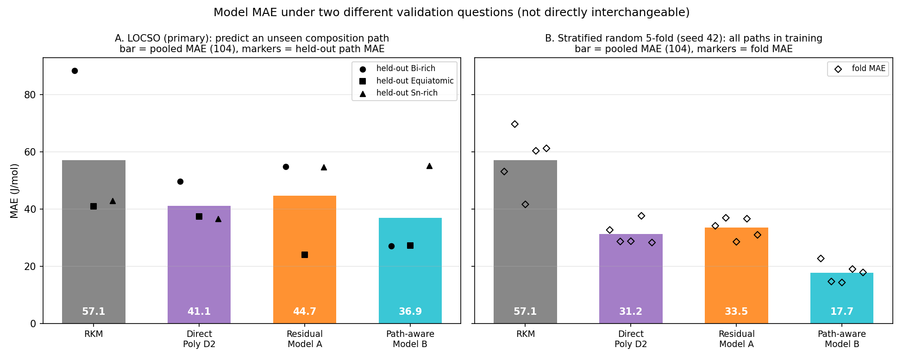

# Controlled Model Comparison

Script: `scripts/step_8_controlled_model_comparison.py`. Machine-readable results: `reports/controlled_model_comparison.csv`. Figure: `figures/model_validation_comparison.png`.

## Objective

Steps 1–4 showed that the 104 experimental observations lie on three composition paths with different Bi/(Bi+Sn) ratios, and that the RKM residual has a strong path-dependent component, especially near the In-rich corner (`reports/cross_section_residual_structure.md`). A model's measured performance therefore depends on *which question* the validation asks. This report evaluates the four existing models, unchanged, under two validation regimes on the same data:

- **Validation A — LOCSO** (primary): can the model predict a composition path it has never seen?
- **Validation B — stratified random 5-fold**: how well does the model interpolate/generalise when the training data contain observations from all three paths?

These are different questions. Validation B is not a replacement for LOCSO and is not presented as more rigorous.

## Models

| Model | Target fitted | Inputs | Prediction |
| --- | --- | --- | --- |
| RKM | none (fixed Table IV parameters, never refitted) | xBi, xIn, xSn | ΔmixH_RKM (temperature-independent) |
| Direct Poly D2 | ΔmixH_exp | PolyD2(xBi, xIn, T) | fitted value |
| Residual Model A | ΔmixH_exp − ΔmixH_RKM | PolyD2(xBi, xIn, T) | RKM + predicted residual |
| Path-aware Model B | ΔmixH_exp − ΔmixH_RKM | PolyD2(xBi, xIn, T, bi_sn_fraction), bi_sn_fraction = xBi/(xBi+xSn) | RKM + predicted residual |

All fitted models use the existing `PolynomialFeatures(degree=2)` + minimum-norm `np.linalg.lstsq` code (`scripts/analyze_composition_representation.py`), no regularisation and no tuning. In every fold the polynomial is fitted on training observations only; RKM predictions come from the unchanged `src/rkm_model.py`. Only `data/original_experimental_data.csv` (104 rows) is used; no synthetic data, no RKM-generated training targets.

## Validation A — LOCSO

Benchmark reproduction (all within rounding of the frozen values): RKM MAE 57.13 / RMSE 73.49 / R² 0.9510; Direct Poly D2 MAE 41.10 / RMSE 56.34 / R² 0.9712; Residual Model A MAE 44.66 / RMSE 55.75 / R² 0.9718; Path-aware Model B MAE 36.86 / RMSE 44.76 / R² 0.9818. Model A and Model B held-out predictions match the Step 1 / Step 3 output files to 2e-13 J/mol.

Fold-wise results:

| Fold | Held-out path | Train / test | Model | MAE | RMSE | R² |
| ---: | --- | --- | --- | ---: | ---: | ---: |
| 1 | Bi-rich | 70 / 34 | RKM | 88.38 | 105.90 | 0.9018 |
| 1 | Bi-rich | 70 / 34 | Direct Poly D2 | 49.67 | 67.32 | 0.9603 |
| 1 | Bi-rich | 70 / 34 | Residual Model A | 54.74 | 68.56 | 0.9588 |
| 1 | Bi-rich | 70 / 34 | Path-aware Model B | 27.08 | 34.29 | 0.9897 |
| 2 | Equiatomic | 70 / 34 | RKM | 40.98 | 50.63 | 0.9656 |
| 2 | Equiatomic | 70 / 34 | Direct Poly D2 | 37.35 | 49.00 | 0.9677 |
| 2 | Equiatomic | 70 / 34 | Residual Model A | 23.95 | 29.93 | 0.9880 |
| 2 | Equiatomic | 70 / 34 | Path-aware Model B | 27.28 | 33.36 | 0.9851 |
| 3 | Sn-rich | 68 / 36 | RKM | 42.88 | 50.88 | 0.9369 |
| 3 | Sn-rich | 68 / 36 | Direct Poly D2 | 36.56 | 51.21 | 0.9361 |
| 3 | Sn-rich | 68 / 36 | Residual Model A | 54.70 | 60.78 | 0.9100 |
| 3 | Sn-rich | 68 / 36 | Path-aware Model B | 55.15 | 60.21 | 0.9116 |

Pooled over all 104 held-out predictions:

| Model | MAE | RMSE | R² |
| --- | ---: | ---: | ---: |
| RKM | 57.13 | 73.49 | 0.9510 |
| Direct Poly D2 | 41.10 | 56.34 | 0.9712 |
| Residual Model A | 44.66 | 55.75 | 0.9718 |
| Path-aware Model B | 36.86 | 44.76 | 0.9818 |

The RKM rows in this and the following tables are not out-of-sample LOCSO results. RKM is never refitted in this project, so its "held-out" values are simply its errors on those observations. Its ternary parameters were fitted by the original authors to the experimental measurements reported in the paper. RKM is therefore a physics-model reference, not an independent LOCSO score.

## Validation B — Stratified Random 5-Fold

`sklearn.model_selection.StratifiedKFold(n_splits=5, shuffle=True, random_state=42)`, stratified on the cross-section label (seed = project `RANDOM_SEED` from `scripts/validate_dataset.py`). Training sizes 83, 84; test sizes 20, 21. Every fold's test set contains all three paths, and every observation is predicted exactly once. For the residual models the residual is computed from the fixed RKM prediction and the residual model is fitted on the training observations only.

| Fold | Train / test | Test n (Bi-rich / Equiatomic / Sn-rich) | Model | MAE | RMSE | R² |
| ---: | --- | --- | --- | ---: | ---: | ---: |
| 1 | 83 / 21 | 7 / 7 / 7 | RKM | 53.09 | 74.01 | 0.9533 |
| 1 | 83 / 21 | 7 / 7 / 7 | Direct Poly D2 | 32.67 | 49.50 | 0.9791 |
| 1 | 83 / 21 | 7 / 7 / 7 | Residual Model A | 34.12 | 39.68 | 0.9866 |
| 1 | 83 / 21 | 7 / 7 / 7 | Path-aware Model B | 22.71 | 30.93 | 0.9918 |
| 2 | 83 / 21 | 7 / 7 / 7 | RKM | 69.66 | 85.63 | 0.9418 |
| 2 | 83 / 21 | 7 / 7 / 7 | Direct Poly D2 | 28.65 | 33.19 | 0.9913 |
| 2 | 83 / 21 | 7 / 7 / 7 | Residual Model A | 36.91 | 40.28 | 0.9871 |
| 2 | 83 / 21 | 7 / 7 / 7 | Path-aware Model B | 14.67 | 19.10 | 0.9971 |
| 3 | 83 / 21 | 7 / 7 / 7 | RKM | 41.61 | 48.09 | 0.9738 |
| 3 | 83 / 21 | 7 / 7 / 7 | Direct Poly D2 | 28.75 | 34.29 | 0.9867 |
| 3 | 83 / 21 | 7 / 7 / 7 | Residual Model A | 28.54 | 36.30 | 0.9851 |
| 3 | 83 / 21 | 7 / 7 / 7 | Path-aware Model B | 14.32 | 18.70 | 0.9960 |
| 4 | 83 / 21 | 7 / 6 / 8 | RKM | 60.32 | 73.86 | 0.9643 |
| 4 | 83 / 21 | 7 / 6 / 8 | Direct Poly D2 | 37.61 | 50.85 | 0.9831 |
| 4 | 83 / 21 | 7 / 6 / 8 | Residual Model A | 36.60 | 43.15 | 0.9878 |
| 4 | 83 / 21 | 7 / 6 / 8 | Path-aware Model B | 19.02 | 25.21 | 0.9958 |
| 5 | 84 / 20 | 6 / 7 / 7 | RKM | 61.18 | 80.49 | 0.8429 |
| 5 | 84 / 20 | 6 / 7 / 7 | Direct Poly D2 | 28.28 | 35.36 | 0.9697 |
| 5 | 84 / 20 | 6 / 7 / 7 | Residual Model A | 30.96 | 38.62 | 0.9638 |
| 5 | 84 / 20 | 6 / 7 / 7 | Path-aware Model B | 17.84 | 21.23 | 0.9891 |

Pooled over all 104 held-out predictions, with per-path MAE of those same predictions:

| Model | MAE | RMSE | R² | Bi-rich MAE | Equiatomic MAE | Sn-rich MAE |
| --- | ---: | ---: | ---: | ---: | ---: | ---: |
| RKM | 57.13 | 73.49 | 0.9510 | 88.38 | 40.98 | 42.88 |
| Direct Poly D2 | 31.22 | 41.44 | 0.9844 | 14.96 | 40.71 | 37.62 |
| Residual Model A | 33.45 | 39.68 | 0.9857 | 40.31 | 25.07 | 34.89 |
| Path-aware Model B | 17.71 | 23.50 | 0.9950 | 16.50 | 27.43 | 9.67 |

RKM is identical under both schemes because it is never refitted in this project; its parameters are fixed from the paper.

Design-matrix rank (rank / number of polynomial terms) in the training data of each fold:

| Scheme | Direct Poly D2 | Model A | Model B |
| --- | --- | --- | --- |
| LOCSO (two paths in training) | 9/10 | 9/10 | 11/15 |
| Random 5-fold (three paths in training) | 10/10 | 10/10 | 14/15 |

The ranks were identical in every fold of each scheme. With two training paths, all points lie on two straight lines in the (xBi, xIn) plane, so one quadratic direction (and, for Model B, more) is undetermined. With three paths the (xBi, xIn, T) polynomial is full rank; Model B keeps one exact dependency because bi_sn_fraction·xIn = bi_sn_fraction − xBi holds identically.

## Cross-section stability

LOCSO, MAE (J/mol) of each held-out path:

| Model | Pooled MAE | Bi-rich | Equiatomic | Sn-rich | Best-section MAE | Worst-section MAE | SD of section MAEs |
| --- | ---: | ---: | ---: | ---: | ---: | ---: | ---: |
| RKM | 57.13 | 88.38 | 40.98 | 42.88 | 40.98 | 88.38 | 26.83 |
| Direct Poly D2 | 41.10 | 49.67 | 37.35 | 36.56 | 36.56 | 49.67 | 7.35 |
| Residual Model A | 44.66 | 54.74 | 23.95 | 54.70 | 23.95 | 54.74 | 17.77 |
| Path-aware Model B | 36.86 | 27.08 | 27.28 | 55.15 | 27.08 | 55.15 | 16.15 |

Fold-MAE stability (descriptive only; not a significance test; LOCSO has only 3 folds):

| Model | LOCSO mean | LOCSO SD | LOCSO min | LOCSO max | Random mean | Random SD | Random min | Random max |
| --- | ---: | ---: | ---: | ---: | ---: | ---: | ---: | ---: |
| RKM | 57.41 | 26.83 | 40.98 | 88.38 | 57.17 | 10.50 | 41.61 | 69.66 |
| Direct Poly D2 | 41.19 | 7.35 | 36.56 | 49.67 | 31.19 | 4.01 | 28.28 | 37.61 |
| Residual Model A | 44.46 | 17.77 | 23.95 | 54.74 | 33.43 | 3.63 | 28.54 | 36.91 |
| Path-aware Model B | 36.50 | 16.15 | 27.08 | 55.15 | 17.71 | 3.45 | 14.32 | 22.71 |

Summary across both questions (pooled MAE, J/mol):

| Model | LOCSO | Random 5-fold | LOCSO worst path |
| --- | ---: | ---: | ---: |
| RKM | 57.13 | 57.13 | 88.38 |
| Direct Poly D2 | 41.10 | 31.22 | 49.67 |
| Residual Model A | 44.66 | 33.45 | 54.74 |
| Path-aware Model B | 36.86 | 17.71 | 55.15 |

## Interpretation

### Cross-path extrapolation

**Observed.**

- Lowest pooled LOCSO MAE: Path-aware Model B (36.86 J/mol). Lowest worst-path LOCSO MAE: Direct Poly D2 (49.67 J/mol). These are different models.
- Model B is best on the Bi-rich path (27.08) but worst of all four on the Sn-rich path (55.15); its section MAEs span 27.08–55.15 (SD 16.15).
- Model A is best on the Equiatomic path (23.95) — the only held-out path that lies between the two training paths — and worse than RKM on Sn-rich (54.70 vs 42.88).
- Direct Poly D2 has the narrowest section spread (36.56–49.67, SD 7.35) and is the only fitted model below RKM on every held-out path, but it is not the best on any single path except Sn-rich.
- RKM, which is not refitted here, ranges from 40.98 (Equiatomic) to 88.38 (Bi-rich).

**Interpretation.** Under LOCSO no model is uniformly best. The ranking depends on which path is held out, and pooled MAE hides this: Model B's pooled advantage comes from one fold. This is consistent with Step 4: the residual contains a large path-dependent level that must be extrapolated from two paths, and different model forms extrapolate it differently, with no way to check the extrapolation from the training data alone (rank-deficient designs).

### Within-path interpolation/generalization

**Observed.**

- With all three paths represented in training, every fitted model improves relative to LOCSO: Direct 41.10 → 31.22, Model A 44.66 → 33.45, Model B 36.86 → 17.71 J/mol.
- The largest change is Model B on Sn-rich: 55.15 (LOCSO) → 9.67 J/mol (random 5-fold).
- Fold-to-fold variation is small for all fitted models (fold-MAE SD 4.01, 3.63, 3.45 for Direct, A, B).
- Under random 5-fold, Model B's largest per-path error is on the Equiatomic path (27.43), about the same as its LOCSO Equiatomic MAE (27.28); Direct Poly D2's Equiatomic MAE (40.71) is about the same as RKM's (40.98).

**Interpretation.** When every path is present in training, the path-dependent level of the residual only needs to be *interpolated* along each path, and a model with an explicit Bi/Sn composition coordinate can represent a separate level per path (its design becomes identifiable in that direction). That explains why Model B gains most under random 5-fold and why its Sn-rich error collapses there. It is a statement about representing the three measured paths, not about predicting a fourth.

Why the two schemes disagree: random 5-fold test points always have close neighbours on the *same* path in the training set (typically adjacent titration points), so the path-dependent residual level is seen during training. LOCSO removes the entire path, so that level must be extrapolated across the Bi/Sn coordinate from only two other paths. The gap between the two columns is therefore a measure of how much each model depends on having seen the path.

## Scientific implications

**Supported by these results**

- All three fitted models reduce pooled error relative to RKM under both regimes on these 104 observations.
- Model B represents the three measured paths much better than the other models (random 5-fold), consistent with the strong path-dependent residual structure found in Step 4.
- Cross-path extrapolation remains unresolved: under LOCSO the best model depends on the held-out path, and only Direct Poly D2 is below RKM on every held-out path, with a small margin on the Equiatomic and Sn-rich paths.
- Performance claims for unmeasured Bi/Sn ratios should be based on LOCSO, with per-path results reported alongside pooled values.

**Not supported by these results**

- That Model B is universally superior: it is worst on the Sn-rich LOCSO fold.
- That random 5-fold is more rigorous than LOCSO: it answers an easier, different question (interpolation within measured paths) and LOCSO remains the primary cross-path validation.
- That synthetic data are needed: nothing here tests synthetic data, and the limitation identified is the number of independent experimental composition paths (three), not the number of points per path.
- That RKM is thermodynamically inferior: RKM is a fixed, temperature-independent model that is never refitted in this project. Its binary parameters come from the authors' earlier work, and the RKM ternary parameters used here were fitted by the original authors using the experimental measurements reported in the paper. RKM was not independently trained under LOCSO. Fitted models having lower MAE on the data they are calibrated against does not imply a better thermodynamic description.
- R² is reported as the coefficient of determination on held-out predictions. It is not an accuracy measure, and with ΔmixH spanning ≈ −64 to −1413 J/mol it stays high even when errors of 50–100 J/mol occur.

No model is selected or replaced in this step. The website and the final model are unchanged.
