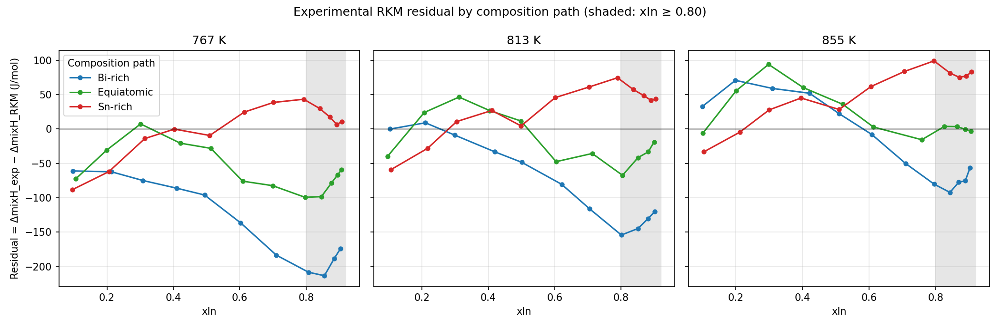
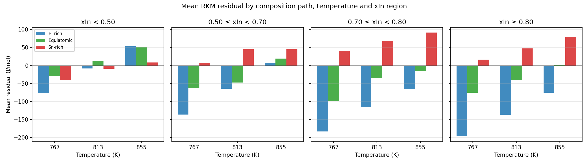
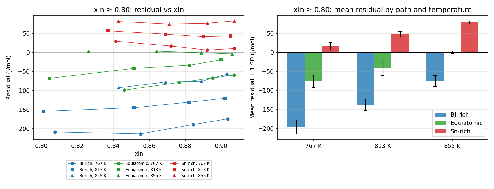
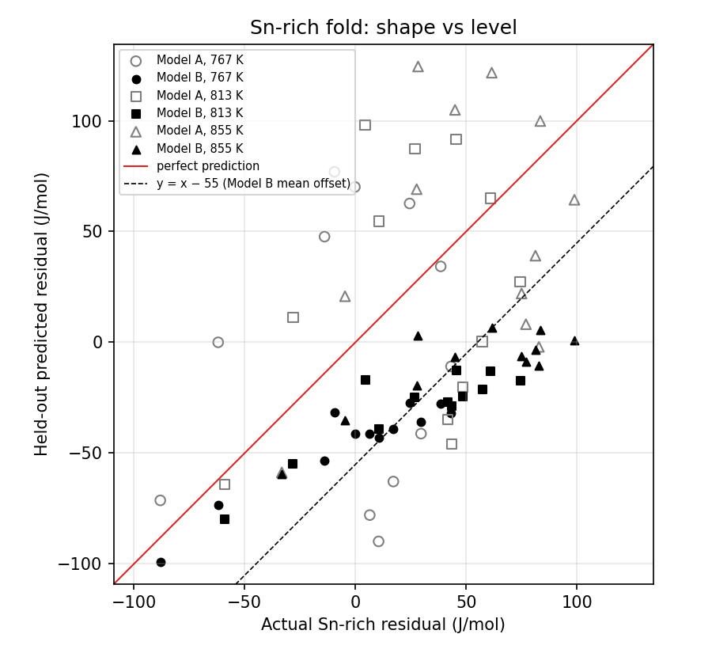

# Cross-Section Residual Structure

Script: `scripts/step_7_cross_section_residual_structure.py`. Data: `data/original_experimental_data.csv` only (104 observations); RKM from `src/rkm_model.py`. Model A / Model B held-out predicted residuals are read from `reports/residual_learning_results.csv` and `reports/path_aware_residual_results.csv` (nothing retrained). No synthetic data, Dataset A or Dataset B were loaded. Diagnostic only: no prediction model is proposed.

## Objective

Under LOCSO, residual learning on two composition paths fails on the Sn-rich path (MAE: RKM 42.88, Model A 54.70, path-aware Model B 55.15 J/mol). Model B reproduces the Sn-rich residual *shape* (correlation ≈ 0.91) but misses its *level* (mean error ≈ +55 J/mol). This diagnostic asks whether the experimental RKM residual contains a systematic cross-section (Bi/Sn composition-path) component that two paths cannot pin down for the third.

## Experimental residual definition

```text
residual = ΔmixH_exp − ΔmixH_RKM
```

RKM is temperature-independent, so any temperature dependence in the residual comes from the measurements. Residuals were recomputed here and agree with the Step 1 and Step 3 files to < 1e-9 J/mol.

Actual xIn values (no interpolation is used anywhere in this analysis):

| T (K) | Path | xIn values |
| ---: | --- | --- |
| 767 | Bi-rich | 0.098, 0.213, 0.308, 0.410, 0.494, 0.603, 0.710, 0.807, 0.855, 0.884, 0.904 |
| 767 | Equiatomic | 0.106, 0.200, 0.301, 0.421, 0.513, 0.609, 0.699, 0.797, 0.846, 0.876, 0.895, 0.907 |
| 767 | Sn-rich | 0.096, 0.206, 0.314, 0.403, 0.510, 0.614, 0.702, 0.793, 0.841, 0.872, 0.892, 0.907 |
| 813 | Bi-rich | 0.103, 0.210, 0.298, 0.419, 0.501, 0.621, 0.705, 0.801, 0.852, 0.882, 0.902 |
| 813 | Equiatomic | 0.095, 0.206, 0.311, 0.404, 0.498, 0.604, 0.713, 0.805, 0.852, 0.882, 0.900 |
| 813 | Sn-rich | 0.106, 0.216, 0.304, 0.410, 0.499, 0.601, 0.704, 0.790, 0.837, 0.869, 0.890, 0.905 |
| 855 | Bi-rich | 0.100, 0.199, 0.310, 0.421, 0.510, 0.608, 0.710, 0.795, 0.843, 0.869, 0.889, 0.903 |
| 855 | Equiatomic | 0.101, 0.202, 0.299, 0.403, 0.521, 0.613, 0.758, 0.826, 0.864, 0.889, 0.906 |
| 855 | Sn-rich | 0.105, 0.212, 0.300, 0.396, 0.510, 0.606, 0.706, 0.795, 0.843, 0.871, 0.892, 0.907 |

All three paths span nearly the same xIn range (≈ 0.095–0.907) with a similar titration grid, but the individual xIn points do not coincide exactly; the closest matches are quantified under *Matched-composition comparison*.

## Cross-section comparison

| Path (all xIn) | n | Mean | Median | SD | MAE | RMSE |
| --- | ---: | ---: | ---: | ---: | ---: | ---: |
| Bi-rich | 34 | -74.0 | -76.3 | 76.9 | 88.4 | 105.9 |
| Equiatomic | 34 | -19.2 | -19.8 | 47.6 | 41.0 | 50.6 |
| Sn-rich | 36 | 26.3 | 29.0 | 44.2 | 42.9 | 50.9 |

| Temperature (all paths) | n | Mean | Median | SD | MAE | RMSE |
| --- | ---: | ---: | ---: | ---: | ---: | ---: |
| 767 K | 35 | -62.6 | -62.2 | 70.7 | 72.8 | 93.7 |
| 813 K | 34 | -19.9 | -13.9 | 62.3 | 51.1 | 64.6 |
| 855 K | 35 | 18.5 | 27.7 | 54.4 | 47.3 | 56.7 |

| Path, xIn ≥ 0.70 | n | Mean | Median | SD | MAE | RMSE |
| --- | ---: | ---: | ---: | ---: | ---: | ---: |
| Bi-rich | 16 | -129.0 | -125.0 | 54.0 | 129.0 | 139.2 |
| Equiatomic | 15 | -40.7 | -35.6 | 35.9 | 41.7 | 53.5 |
| Sn-rich | 18 | 53.9 | 52.8 | 27.3 | 53.9 | 60.1 |

| Path, xIn ≥ 0.80 | n | Mean | Median | SD | MAE | RMSE |
| --- | ---: | ---: | ---: | ---: | ---: | ---: |
| Bi-rich | 12 | -136.2 | -137.4 | 53.5 | 136.2 | 145.5 |
| Equiatomic | 12 | -38.4 | -37.5 | 35.5 | 39.6 | 51.3 |
| Sn-rich | 12 | 47.6 | 46.0 | 27.7 | 47.6 | 54.5 |

MAE here is the mean absolute residual (= RKM MAE on that subset).

**OBSERVATION.** Pooled over temperature, the mean residual is ordered Bi-rich < Equiatomic < Sn-rich, and the separation is much larger at high In content than overall.

## Temperature-controlled comparison

Mean residual (J/mol) by path at fixed temperature and xIn region (n per path in brackets). "Ordered" = Bi-rich < Equiatomic < Sn-rich.

| T (K) | xIn region | Bi-rich | Equiatomic | Sn-rich | Range across paths | Ordered |
| ---: | --- | ---: | ---: | ---: | ---: | :---: |
| 767 | xIn < 0.50 | -76.0 (5) | -29.1 (4) | -41.1 (4) | 47.0 | no |
| 767 | 0.50 ≤ xIn < 0.70 | -136.4 (1) | -62.2 (3) | 7.5 (2) | 143.9 | yes |
| 767 | 0.70 ≤ xIn < 0.80 | -183.3 (1) | -99.3 (1) | 40.9 (2) | 224.2 | yes |
| 767 | xIn ≥ 0.80 | -196.0 (4) | -75.6 (4) | 15.9 (4) | 212.0 | yes |
| 813 | xIn < 0.50 | -8.3 (4) | 13.7 (5) | -9.1 (5) | 22.7 | no |
| 813 | 0.50 ≤ xIn < 0.70 | -64.5 (2) | -47.5 (1) | 45.5 (1) | 110.0 | yes |
| 813 | 0.70 ≤ xIn < 0.80 | -116.0 (1) | -35.6 (1) | 67.7 (2) | 183.7 | yes |
| 813 | xIn ≥ 0.80 | -137.2 (4) | -40.3 (4) | 47.7 (4) | 184.9 | yes |
| 855 | xIn < 0.50 | 53.5 (4) | 50.8 (4) | 8.7 (4) | 44.8 | no |
| 855 | 0.50 ≤ xIn < 0.70 | 7.1 (2) | 19.4 (2) | 44.9 (2) | 37.8 | yes |
| 855 | 0.70 ≤ xIn < 0.80 | -65.2 (2) | -15.7 (1) | 91.2 (2) | 156.4 | yes |
| 855 | xIn ≥ 0.80 | -75.3 (4) | 0.8 (4) | 79.1 (4) | 154.3 | yes |

**OBSERVATION.** The ordering holds in 9 of 12 temperature × region cells. It holds in all 6 of 6 cells with xIn ≥ 0.70 (range across paths 154–224 J/mol), and in 0 of 3 cells with xIn < 0.50 (range 23–47 J/mol). The 0.50–0.70 cells are ordered but contain only 1–3 points per path. The path effect is therefore present at fixed temperature, and it is concentrated at high In content. Its size decreases with temperature in the In-rich cells.





## High-In residual behavior

Within xIn ≥ 0.80 (4 points per path per temperature): mean residual and least-squares slope of residual vs xIn. Slopes from 4 points spanning only ≈ 0.1 in xIn are imprecise (standard errors shown).

| Path | T (K) | n | Mean residual | Slope d(residual)/d(xIn) | Slope SE |
| --- | ---: | ---: | ---: | ---: | ---: |
| Bi-rich | 767 | 4 | -196.0 | 356 | 176 |
| Bi-rich | 813 | 4 | -137.2 | 335 | 57 |
| Bi-rich | 855 | 4 | -75.3 | 534 | 131 |
| Equiatomic | 767 | 4 | -75.6 | 646 | 3 |
| Equiatomic | 813 | 4 | -40.3 | 482 | 50 |
| Equiatomic | 855 | 4 | 0.8 | -89 | 30 |
| Sn-rich | 767 | 4 | 15.9 | -330 | 95 |
| Sn-rich | 813 | 4 | 47.7 | -224 | 54 |
| Sn-rich | 855 | 4 | 79.1 | 13 | 92 |

Differences between path means at xIn ≥ 0.80:

| T (K) | Equiatomic − Bi-rich | Sn-rich − Equiatomic | Sn-rich − Bi-rich |
| ---: | ---: | ---: | ---: |
| 767 | 120.4 | 91.6 | 212.0 |
| 813 | 97.0 | 88.0 | 184.9 |
| 855 | 76.1 | 78.3 | 154.3 |



**OBSERVATION.** Near the In-rich corner the three paths are cleanly separated at every temperature: the Sn-rich − Bi-rich gap is 154–212 J/mol, compared with within-path scatter of ≈ 14 J/mol (next sections). The gap shrinks as temperature rises (767 → 855 K), while all three paths shift upward with temperature. Within xIn ≥ 0.80 the residual trend with xIn differs in sign between paths (positive slopes for Bi-rich, mostly negative for Sn-rich), but these slopes are imprecise.

## Matched-composition comparison

To rule out that path differences merely reflect different xIn values, observations were matched one-to-one at the **same temperature** with |ΔxIn| ≤ 0.01 (no point reused; no interpolation). For triplets, all three pairwise |ΔxIn| ≤ 0.01.

Sensitivity of match counts to the tolerance (pairs / triplets): ±0.005: 41 / 5; ±0.01: 68 / 11; ±0.02: 98 / 31.

Matched pairs (residual difference, first path minus second, J/mol):

| Pair | n | Mean diff | SD | Min | Max |
| --- | ---: | ---: | ---: | ---: | ---: |
| Bi-rich − Equiatomic | 20 | -57.0 | 51.6 | -114.9 | 40.0 |
| Bi-rich − Sn-rich | 24 | -92.1 | 89.4 | -221.9 | 65.8 |
| Equiatomic − Sn-rich | 24 | -47.3 | 61.6 | -142.5 | 66.2 |

Matched triplets (11). `Mid. dev.` = Equiatomic − ½(Bi-rich + Sn-rich): the deviation of the middle path from the midpoint of the outer two. Since bi_sn_fraction is 0.6675 / 0.5000 / 0.3334, the Equiatomic path lies almost exactly halfway, so a small `Mid. dev.` relative to the gap means the three residuals are close to evenly spaced in this coordinate (a description of three points, not evidence of a linear law).

| T (K) | xIn (B / E / S) | Bi-rich | Equiatomic | Sn-rich | Sn − Bi gap | Ordered | Mid. dev. |
| ---: | --- | ---: | ---: | ---: | ---: | :---: | ---: |
| 767 | 0.904 / 0.907 / 0.907 | -173.9 | -59.0 | 10.5 | 184.3 | yes | +22.7 |
| 813 | 0.210 / 0.206 / 0.216 | 9.0 | 23.8 | -28.2 | -37.2 | no | +33.5 |
| 813 | 0.501 / 0.498 / 0.499 | -48.5 | 11.5 | 4.4 | 52.9 | no | +33.6 |
| 813 | 0.705 / 0.713 / 0.704 | -116.0 | -35.6 | 61.0 | 177.0 | yes | -8.2 |
| 813 | 0.882 / 0.882 / 0.890 | -130.1 | -33.3 | 41.7 | 171.8 | yes | +10.9 |
| 813 | 0.902 / 0.900 / 0.905 | -120.0 | -18.9 | 43.5 | 163.5 | yes | +19.4 |
| 855 | 0.100 / 0.101 / 0.105 | 32.6 | -6.4 | -33.2 | -65.8 | no | -6.0 |
| 855 | 0.608 / 0.613 / 0.606 | -8.0 | 2.9 | 61.6 | 69.5 | yes | -23.9 |
| 855 | 0.869 / 0.864 / 0.871 | -77.4 | 3.4 | 75.0 | 152.4 | yes | +4.6 |
| 855 | 0.889 / 0.889 / 0.892 | -75.3 | -0.6 | 77.0 | 152.3 | yes | -1.4 |
| 855 | 0.903 / 0.906 / 0.907 | -56.3 | -3.5 | 82.9 | 139.1 | yes | -16.8 |

**OBSERVATION.** 11 matched triplets exist (7 with mean xIn ≥ 0.70). The ordering holds in 7/7 high-In triplets and 1/4 triplets below xIn 0.70. For high-In triplets the Sn − Bi gap is 139–184 J/mol and |Mid. dev.| is 1–23 J/mol (median 11). The path differences therefore persist at matched composition and temperature; they are not an artefact of comparing different xIn values.

## Between-section vs within-section variation

**(a) ANOVA-style decomposition within cells.** Observations are grouped into temperature × xIn-region cells (regions as above). Within each cell, the residual sum of squares is split into between-path and within-path parts, then pooled over cells. η² = SS_between / (SS_between + SS_within). Temperature and coarse xIn effects are removed by construction because comparisons are only made inside cells.

| Subset | n | SS between paths | SS within paths | η² (path) | Within-path SD (J/mol) | F (df) | p |
| --- | ---: | ---: | ---: | ---: | ---: | --- | ---: |
| All xIn | 104 | 328656 | 38839 | 0.894 | 23.9 | 24.0 (24, 68) | 2.0e-24 |
| xIn ≥ 0.70 | 49 | 292182 | 5651 | 0.981 | 13.5 | 133.6 (12, 31) | 3.3e-23 |
| xIn ≥ 0.80 | 36 | 206511 | 4986 | 0.976 | 13.6 | 186.4 (6, 27) | 1.1e-20 |

**(b) Transparent linear diagnostic (not a prediction model; in-sample, no validation).** `common(xIn, T)` = separate intercept, linear and quadratic xIn terms for each temperature (9 parameters). `+ section` adds a constant offset for two of the paths. `+ section×xIn` lets that offset change linearly with xIn. Nested F-tests compare successive rows.

| Subset | Terms | Parameters | R² | Residual SD (J/mol) | ΔR² | F | p |
| --- | --- | ---: | ---: | ---: | ---: | ---: | ---: |
| All xIn (n=104) | common | 9 | 0.269 | 62.9 | — | — | — |
| All xIn (n=104) | common + section | 11 | 0.627 | 45.4 | +0.357 | 44.5 | 2.8e-14 |
| All xIn (n=104) | common + section + section×xIn | 13 | 0.895 | 24.4 | +0.268 | 116.1 | 9.0e-26 |
| xIn ≥ 0.70 (n=49) | common | 9 | 0.154 | 87.1 | — | — | — |
| xIn ≥ 0.70 (n=49) | common + section | 11 | 0.965 | 18.2 | +0.811 | 438.6 | 5.6e-27 |
| xIn ≥ 0.70 (n=49) | common + section + section×xIn | 13 | 0.969 | 17.6 | +0.004 | 2.2 | 1.2e-01 |
| xIn ≥ 0.80 (n=36) | common | 9 | 0.258 | 84.0 | — | — | — |
| xIn ≥ 0.80 (n=36) | common + section | 11 | 0.976 | 15.6 | +0.718 | 377.2 | 2.1e-19 |
| xIn ≥ 0.80 (n=36) | common + section + section×xIn | 13 | 0.983 | 13.6 | +0.007 | 5.0 | 1.6e-02 |

**OBSERVATION.** At fixed temperature and xIn region, the path accounts for η² = 0.89 of residual variation over all xIn, 0.98 for xIn ≥ 0.70 and 0.98 for xIn ≥ 0.80; the within-path SD at high In is only ≈ 14 J/mol. In the linear diagnostic for xIn ≥ 0.80, a common xIn–T trend alone explains R² = 0.26; adding one constant offset per path raises this to 0.98 (residual SD 84 → 16 J/mol). Over all xIn, a constant path offset is not enough (R² 0.63); allowing it to vary with xIn raises R² to 0.89, consistent with a path effect that is small at low xIn and large near the In corner.

Caveat: these are in-sample descriptive fits on 104 (or 49 / 36) correlated points from only three paths; p-values assume independent errors and should be read as indicative only.

## Implications for residual learning

Model A and Model B held-out predictions on the Sn-rich path (read from existing outputs). Error decomposition: MSE = bias² + (SD_actual − SD_pred)² + 2·SD_actual·SD_pred·(1 − r). `MAE after removing mean offset` is the MAE that would remain if the mean error were subtracted (diagnostic only).

| Subset | Model | MAE | Mean error (bias) | corr | SD actual | SD pred | bias² | scale term | shape term | MAE after removing mean offset |
| --- | --- | ---: | ---: | ---: | ---: | ---: | ---: | ---: | ---: | ---: |
| Sn-rich, all | A | 54.7 | +3.5 | 0.36 | 43.6 | 60.6 | 12 | 290 | 3392 | 54.7 |
| Sn-rich, all | B | 55.1 | +55.1 | 0.91 | 43.6 | 23.7 | 3041 | 393 | 191 | 20.2 |
| Sn-rich, xIn ≥ 0.70 | A | 57.6 | +55.3 | 0.83 | 26.5 | 50.5 | 3063 | 576 | 453 | 25.3 |
| Sn-rich, xIn ≥ 0.70 | B | 74.7 | +74.7 | 0.96 | 26.5 | 14.5 | 5573 | 145 | 32 | 10.5 |
| Sn-rich, xIn ≥ 0.80 | A | 73.0 | +73.0 | 0.95 | 26.6 | 38.6 | 5334 | 144 | 106 | 12.9 |
| Sn-rich, xIn ≥ 0.80 | B | 71.7 | +71.7 | 0.98 | 26.6 | 13.6 | 5138 | 167 | 13 | 11.1 |

Matched high-In triplets: actual vs held-out predicted residual for the **Sn-rich** point (each model trained on Bi-rich + Equiatomic only):

| T (K) | xIn (Sn-rich) | Actual | Model A | Model B | Bi-rich actual | Equiatomic actual |
| ---: | ---: | ---: | ---: | ---: | ---: | ---: |
| 767 | 0.907 | 10.5 | -89.9 | -43.1 | -173.9 | -59.0 |
| 813 | 0.704 | 61.0 | 65.0 | -13.1 | -116.0 | -35.6 |
| 813 | 0.890 | 41.7 | -34.9 | -26.8 | -130.1 | -33.3 |
| 813 | 0.905 | 43.5 | -45.9 | -28.7 | -120.0 | -18.9 |
| 855 | 0.871 | 75.0 | 22.0 | -6.2 | -77.4 | 3.4 |
| 855 | 0.892 | 77.0 | 8.1 | -8.7 | -75.3 | -0.6 |
| 855 | 0.907 | 82.9 | -2.1 | -10.6 | -56.3 | -3.5 |



**OBSERVATION.**

- Model B's Sn-rich error is dominated by bias: bias² = 3041 of MSE 3626 (84%); the shape term is only 191. With the mean offset removed its MAE would be 20.2 J/mol instead of 55.1. Correlation is insensitive to a constant offset, which is how r ≈ 0.91 and MAE ≈ 55 J/mol coexist.
- The bias is largest exactly where the path separation is largest: for Sn-rich xIn ≥ 0.80, Model A bias +73.0 and Model B bias +71.7 J/mol, with correlations 0.95 / 0.98. Both models predict Sn-rich In-rich residuals that lie close to, or below, the Equiatomic level, whereas the measured Sn-rich residuals lie well above it.
- Model B also compresses the Sn-rich residual range (SD predicted 23.7 vs actual 43.6 J/mol).

**INTERPRETATION.**

- The experimental residual contains a systematic path-dependent component that is large relative to within-path scatter, persists at fixed temperature and at matched composition, and is concentrated near the In-rich corner. In LOCSO, the level of this component for the held-out path is exactly the quantity a two-path model must extrapolate.
- Model B learned the within-path shape (common xIn–T structure) but did not place the Sn-rich level beyond the Equiatomic level by the measured amount. Its failure is therefore a failure to extrapolate the path offset, not a failure to learn the shape.
- With three paths, the across-path behaviour at a given (xIn, T) is described by three numbers. A two-path training fold sees two of them, which fixes at most a straight line in the Bi/Sn coordinate and gives no way to check it. The full data set gives one degree of freedom (`Mid. dev.`) to check the spacing, and only at the matched high-In compositions.

**HYPOTHESIS (not tested here).**

- At high In the three paths' residuals are close to evenly spaced in bi_sn_fraction (small `Mid. dev.` relative to the gap). If so, a model whose path term were allowed to vary jointly with xIn and T might extrapolate the Sn-rich level better than the degree-2 models tested, which can represent only limited path × xIn × T interaction and are rank-deficient with two training paths (Step 3). This is a hypothesis about representation, not a recommendation, and three paths may be too few to validate it.
- The decrease of the path gap with temperature could reflect a temperature-dependent interaction that RKM (temperature-independent) cannot represent; no mechanism is claimed.

## Conclusion

1. **Is there evidence for a cross-section-dependent residual component?** Yes. At fixed temperature and xIn region the path explains η² = 0.89 of residual variation overall, and the difference persists for matched compositions at the same temperature.
2. **Is it especially strong near the In-rich corner?** Yes. η² = 0.98 (xIn ≥ 0.70) and 0.98 (xIn ≥ 0.80), with path gaps of ≈ 154–212 J/mol versus ≈ 14 J/mol within-path SD. At xIn < 0.50 the ordering is not consistent and the differences are small.
3. **Is the effect present at fixed temperature?** Yes. The Bi-rich < Equiatomic < Sn-rich ordering holds in all 6 temperature × region cells with xIn ≥ 0.70. Its size decreases from 767 to 855 K.
4. **Can the available three paths adequately constrain that effect?** Only weakly. The path effect is sampled at three Bi/Sn values; under LOCSO a model sees two, which cannot determine curvature in the Bi/Sn coordinate or check extrapolation. The full data set offers a single check (the middle path), which at high In is roughly consistent with even spacing, but that cannot be confirmed with three paths.
5. **Does this explain why a model trained on two paths struggles on the third?** It is consistent with it and accounts for the Sn-rich error pattern: the error is concentrated where the path effect is largest, and Model B's error there is almost entirely a level (bias) error while the shape is captured. This establishes an empirical pattern; it does not identify a thermodynamic mechanism.

## Figures

- `figures/residual_by_section_vs_xIn.png`
- `figures/residual_high_in_section_comparison.png`
- `figures/residual_section_temperature_comparison.png`
- `figures/residual_sn_rich_level_vs_shape.png`
