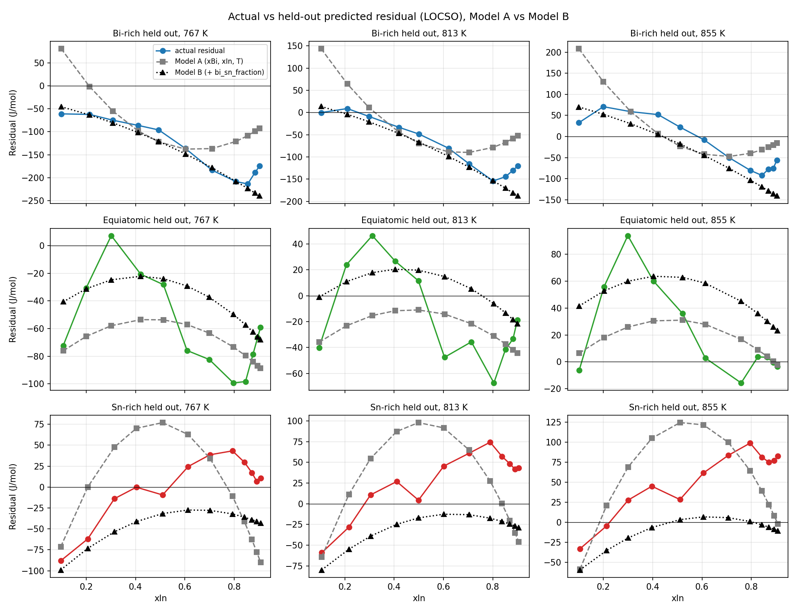

# Path-Aware Residual Learning

Script: `scripts/step_6_path_aware_residual.py`. Per-observation output: `reports/path_aware_residual_results.csv`. Figure: `figures/path_aware_residual_by_section.png`.

## Objective

Step 2 (`reports/residual_diagnostic_analysis.md`) found that RKM + residual Poly D2 is worse than RKM on the Sn-rich held-out section (MAE 42.88 → 54.70 J/mol) and attributed this to composition-dependent extrapolation: the three experimental paths differ in Bi/(Bi+Sn) ratio, the RKM residual changes with that ratio (most strongly at In-rich compositions), and the residual model has no explicit input for it. This experiment tests whether adding a Bi/Sn composition coordinate to the residual model reduces the Sn-rich LOCSO error. It is a single controlled change; no other model, dataset or report was modified, and no synthetic data were used.

## Feature definition

```text
bi_sn_fraction = xBi / (xBi + xSn)
```

Each experimental cross-section is prepared by adding In to a fixed Bi–Sn starting alloy, so along a path xBi and xSn shrink together and their ratio stays constant. `bi_sn_fraction` is therefore constant along each path and identifies which path a composition lies on (a composition-path representation). It is a coordinate, not a thermodynamic law. Note that it is a deterministic function of the existing inputs (bi_sn_fraction = xBi / (1 − xIn)), so it adds no new information about the alloy; it changes only which functions a degree-2 polynomial can express.

Checks: xBi + xIn + xSn = 1 within the project tolerance (1e-08) for all 104 rows; xBi + xSn > 0 for all rows (minimum 0.0927).

| Cross-section | Label | n | Mean bi_sn_fraction | Min | Max |
| --- | --- | ---: | ---: | ---: | ---: |
| `(Sn0.33Bi0.67)1-xInx` | Bi-rich | 34 | 0.6675 | 0.6675 | 0.6675 |
| `(Sn0.50Bi0.50)1-xInx` | Equiatomic | 34 | 0.5000 | 0.5000 | 0.5000 |
| `(Sn0.67Bi0.33)1-xInx` | Sn-rich | 36 | 0.3334 | 0.3334 | 0.3334 |

## Validation protocol

Leave-one-cross-section-out with the same three folds as Step 1. In each fold the residual model (residual = ΔmixH_exp − ΔmixH_RKM) is fitted only on the two training sections and predicts the residual of the held-out section; hybrid = RKM + predicted residual. Both models use `PolynomialFeatures(degree=2)` and the same minimum-norm least-squares fit (`np.linalg.lstsq`), no regularisation and no tuning. The only difference is the extra input `bi_sn_fraction` in Model B.

| Fold | Held out | Train N | Test N | Train bi_sn_fraction values | Model A terms / rank | Model B terms / rank | Model B condition no. |
| ---: | --- | ---: | ---: | --- | --- | --- | ---: |
| 1 | Bi-rich | 70 | 34 | 0.3334, 0.5000 | 10 / 9 | 15 / 11 | 2.69e+23 |
| 2 | Equiatomic | 70 | 34 | 0.3334, 0.6675 | 10 / 9 | 15 / 11 | 4.62e+22 |
| 3 | Sn-rich | 68 | 36 | 0.5000, 0.6675 | 10 / 9 | 15 / 11 | 5.74e+22 |

**Important structural limitation.** Neither design matrix has full rank in any fold, and `lstsq` returns the minimum-norm solution in both cases (the extremely large condition numbers reflect exact rank deficiency, not noise).

- Model A (rank 9 of 10): every training point lies on one of two straight lines in the (xBi, xIn) plane (xBi = r·(1 − xIn) for the two training ratios r). The product of the two line equations is a degree-2 polynomial that is zero on every training point, so one quadratic direction is undetermined. This was already true in Step 1.
- Model B (rank 11 of 15): in addition, each training fold contains only **two** values of `bi_sn_fraction`, so bi_sn_fraction² is an exact linear combination of the constant and bi_sn_fraction, and further products with bi_sn_fraction are tied to existing terms on the two lines.

Consequently, how either model varies *across* paths beyond what two paths can determine is fixed by the minimum-norm rule, not by the data. For the outer held-out paths (Bi-rich, Sn-rich) this matters because their predictions are extrapolations in the Bi/Sn coordinate.

Integrity checks (all passed): 104 observations; 3 folds; held-out section absent from every training set; Model A reproduces the Step 1 predicted residuals exactly (max |difference| = 1.4e-14 J/mol); RKM metrics reproduce the frozen benchmark; direct Poly D2 (xBi, xIn, T) LOCSO recomputed as MAE 41.10, RMSE 56.34, R² 0.9712 (unchanged).

## Results

Pooled LOCSO (104 out-of-fold predictions):

| Model | MAE (J/mol) | RMSE (J/mol) | R² |
| --- | ---: | ---: | ---: |
| RKM | 57.13 | 73.49 | 0.9510 |
| Current residual Poly D2 | 44.66 | 55.75 | 0.9718 |
| Path-aware residual Poly D2 | 36.86 | 44.76 | 0.9818 |

### Cross-section results

MAE (J/mol) on each held-out section:

| Section | RKM | Current Hybrid | Path-aware Hybrid |
| --- | ---: | ---: | ---: |
| Bi-rich | 88.38 | 54.74 | 27.08 |
| Equiatomic | 40.98 | 23.95 | 27.28 |
| Sn-rich | 42.88 | 54.70 | 55.15 |

RMSE / R² per section:

| Section | RKM RMSE | Current RMSE | Path-aware RMSE | RKM R² | Current R² | Path-aware R² |
| --- | ---: | ---: | ---: | ---: | ---: | ---: |
| Bi-rich | 105.90 | 68.56 | 34.29 | 0.9018 | 0.9588 | 0.9897 |
| Equiatomic | 50.63 | 29.93 | 33.36 | 0.9656 | 0.9880 | 0.9851 |
| Sn-rich | 50.88 | 60.78 | 60.21 | 0.9369 | 0.9100 | 0.9116 |

### Temperature results

MAE (J/mol), pooled over the three held-out folds:

| Temperature | RKM | Current Hybrid | Path-aware Hybrid |
| ---: | ---: | ---: | ---: |
| 767 K | 72.77 | 48.61 | 29.13 |
| 813 K | 51.14 | 44.24 | 36.27 |
| 855 K | 47.32 | 41.13 | 45.16 |

### Residual-prediction diagnostics

Error = actual residual − predicted residual (equal to the hybrid error on ΔmixH).

| Scope | Model | corr(actual, predicted) | MAE | RMSE | Mean error | Max abs. error |
| --- | --- | ---: | ---: | ---: | ---: | ---: |
| Overall | A | 0.681 | 44.66 | 55.75 | -9.81 | 175.65 |
| Overall | B | 0.832 | 36.86 | 44.76 | +20.13 | 98.07 |
| Bi-rich | A | 0.766 | 54.74 | 68.56 | -42.74 | 175.65 |
| Bi-rich | B | 0.950 | 27.08 | 34.29 | +22.78 | 84.65 |
| Equiatomic | A | 0.793 | 23.95 | 29.93 | +9.06 | 67.95 |
| Equiatomic | B | 0.818 | 27.28 | 33.36 | -19.61 | 62.32 |
| Sn-rich | A | 0.358 | 54.70 | 60.78 | +3.46 | 100.35 |
| Sn-rich | B | 0.908 | 55.15 | 60.21 | +55.15 | 98.07 |

## Sn-rich diagnosis



**Observed.** Sn-rich held-out MAE: RKM 42.88, Model A 54.70, Model B 55.15 J/mol. The path-aware representation does not reduce the Sn-rich error relative to Model A (+0.44 J/mol) and remains above the RKM baseline (+12.27 J/mol).
Correlation between actual and predicted Sn-rich residual: Model A 0.358, Model B 0.908. Mean error: A +3.46, B +55.15 J/mol. Max abs. error: A 100.35, B 98.07 J/mol.

Mean residual at In-rich compositions (xIn > 0.80) for each held-out section — actual vs held-out predictions:

| Held-out section | T (K) | Actual | Model A | Model B |
| --- | ---: | ---: | ---: | ---: |
| Bi-rich | 767 | -196.0 | -105.1 | -225.8 |
| Bi-rich | 813 | -137.2 | -64.2 | -173.2 |
| Bi-rich | 855 | -75.3 | -23.0 | -131.2 |
| Equiatomic | 767 | -75.6 | -84.8 | -63.4 |
| Equiatomic | 813 | -40.3 | -38.6 | -14.8 |
| Equiatomic | 855 | 0.8 | 2.8 | 28.8 |
| Sn-rich | 767 | 15.9 | -68.0 | -39.8 |
| Sn-rich | 813 | 47.7 | -25.2 | -25.3 |
| Sn-rich | 855 | 79.1 | 16.8 | -7.2 |

## Trade-offs

- Bi-rich: Model A 54.74 → Model B 27.08 J/mol (-27.66); RKM 88.38.
- Equiatomic: Model A 23.95 → Model B 27.28 J/mol (+3.33); RKM 40.98.
- Sn-rich: Model A 54.70 → Model B 55.15 J/mol (+0.44); RKM 42.88.
- Pooled: Model A MAE 44.66 → Model B 36.86 J/mol (-7.80); RMSE 55.75 → 44.76.

Sections where Model B is worse than Model A: Equiatomic.

## Interpretation

**Observed results**

1. Pooled LOCSO error falls from MAE 44.66 / RMSE 55.75 (Model A) to 36.86 / 44.76 J/mol (Model B); R² 0.9718 → 0.9818.
2. Almost all of the pooled gain comes from the Bi-rich fold (MAE 54.74 → 27.08). Equiatomic gets slightly worse (23.95 → 27.28) and Sn-rich is essentially unchanged (54.70 → 55.15), still above RKM (42.88).
3. In the Sn-rich fold the *type* of error changes. Model A had little bias but the wrong shape (corr 0.36, bias² = 0% of MSE). Model B follows the shape much better (corr 0.91) but is offset: all 36 of 36 Sn-rich predicted residuals are below the actual residual (mean error +55.15 J/mol, bias² = 84% of MSE), i.e. the Model B hybrid is more exothermic than measured at every Sn-rich point.
4. The Sn-rich offset grows toward the In corner: mean Model B error +21.1 J/mol for xIn < 0.25 versus +71.7 J/mol for xIn > 0.80. At xIn > 0.80 Model B still predicts negative Sn-rich residuals at all three temperatures while the measured ones are positive (table above).
5. By temperature, Model B is better than Model A at 767 K (48.61 → 29.13) and 813 K (44.24 → 36.27) and worse at 855 K (41.13 → 45.16).
6. For the Bi-rich fold Model B tracks the measured residual closely up to xIn ≈ 0.8 (corr 0.95) but overshoots at the In-rich end (xIn > 0.80 mean predicted -226 vs actual -196 J/mol at 767 K).

**Interpretation**

- The Bi/Sn composition coordinate lets the residual model represent a residual that changes from path to path, and this clearly helps the Bi-rich extrapolation. It does **not** solve the Sn-rich problem: it replaces a shape error with a level (bias) error of about the same size.
- The two outer folds respond very differently to the same change, so the pooled improvement should not be read as a general improvement in cross-path extrapolation. With only three paths, each conclusion about an outer path rests on a single fold.
- Temperature is not the target of this change and the per-temperature differences are mixed; they are reported for completeness only.

**Hypotheses (not tested here)**

- Because each training fold contains only two Bi/Sn values and both design matrices are rank-deficient, the across-path behaviour used for the held-out path is partly set by the minimum-norm rule. The Sn-rich offset and the Bi-rich overshoot near the In corner may reflect this rather than a property of the data.
- The measured In-rich residual changes roughly linearly with Bi/Sn ratio across the three paths (Step 2). Model B does not reproduce that trend when extrapolating to the Sn-rich path, possibly because its bi_sn_fraction terms interact with xBi, xIn and T in ways that two paths cannot constrain.

## Scientific conclusion

The experiment's primary question — whether an explicit Bi/Sn composition coordinate reduces the Sn-rich LOCSO error toward or below RKM — is answered **no**: Sn-rich MAE 54.70 (Model A) → 55.15 J/mol (Model B), versus RKM 42.88. The path-aware model improves pooled LOCSO metrics (MAE 44.66 → 36.86, RMSE 55.75 → 44.76), but this gain comes from the Bi-rich fold, with a small loss on the Equiatomic fold.

These results do not support adopting the path-aware residual model as a replacement for the current model, and they do not show that the path-aware feature is generally better. They show that the representation changes how the model extrapolates across paths, with a large benefit for one outer path, no benefit for the other, and a structural identifiability limit (two Bi/Sn values per training fold) that any continuation would need to address. The current final model, the existing direct Poly D2 model, RKM and the Step 1 residual results are unchanged.
