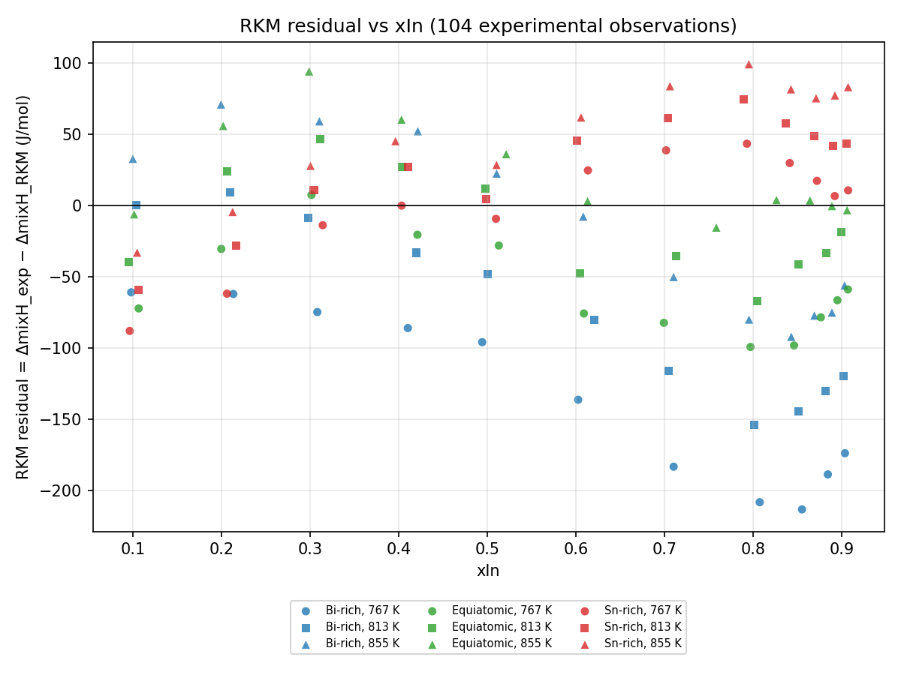
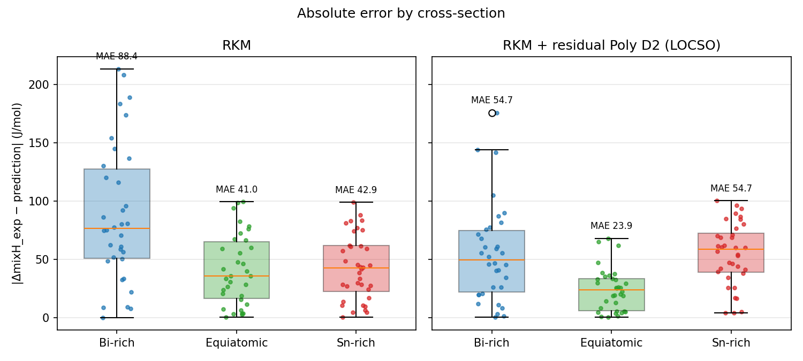
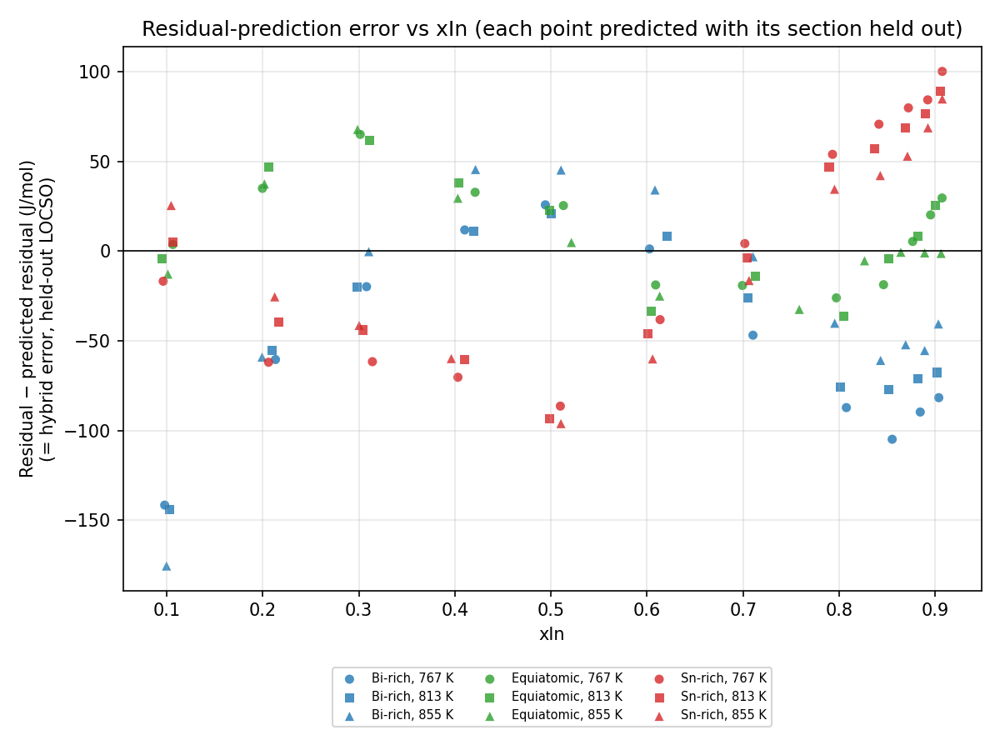
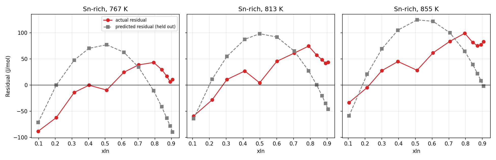
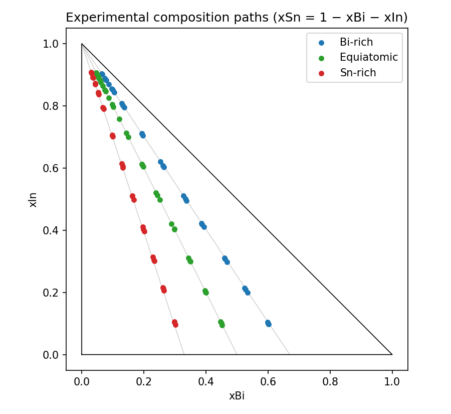

# Residual Learning Diagnostic Analysis

Script: `scripts/step_5_residual_diagnostics.py`. Inputs: `data/original_experimental_data.csv` (104 rows), `reports/residual_learning_results.csv` (existing LOCSO out-of-fold predictions from `scripts/step_4_residual_learning.py`), RKM from `src/rkm_model.py`. No model, dataset or existing report was modified, and no synthetic data were loaded.

Labels used below: **Observed** = directly computed from the data; **Interpretation** = what the observation most plausibly means; **Hypothesis** = a possible explanation that this analysis does not test.

## Objective

RKM + residual Poly D2 (residual = ΔmixH_exp − ΔmixH_RKM, learned as PolyD2(xBi, xIn, T)) improves RKM under LOCSO overall (MAE 57.13 → 44.66 J/mol) and on the Bi-rich and Equiatomic held-out sections, but is worse than RKM on the Sn-rich section (MAE 42.88 → 54.70 J/mol). This analysis investigates why, without changing any model.

## Overall residual behavior

Over all 104 observations the RKM residual has mean -21.35 J/mol, median -8.41, standard deviation 70.66, range -213.27 to 98.91 J/mol. RKM MAE = 57.13, RMSE = 73.49 (identical to the frozen RKM benchmark).

Composition-region summary (In content):

| Region | n | Mean resid. | Median | Std | Min | Max | Mean abs. resid. | RKM MAE | RKM RMSE | Hybrid MAE | Hybrid RMSE |
| --- | ---: | ---: | ---: | ---: | ---: | ---: | ---: | ---: | ---: | ---: | ---: |
| In-lean (xIn < 0.30) | 20 | -13.57 | -18.53 | 49.96 | -88.10 | 93.84 | 42.12 | 42.12 | 50.55 | 51.94 | 70.34 |
| Mid (0.30 ≤ xIn < 0.60) | 25 | 2.10 | 10.71 | 43.84 | -95.99 | 60.04 | 35.00 | 35.00 | 43.00 | 43.00 | 50.47 |
| In-rich (xIn ≥ 0.60) | 59 | -33.91 | -33.29 | 82.68 | -213.27 | 98.91 | 71.60 | 71.60 | 88.71 | 42.90 | 52.17 |

Residual by xBi bin (note: xBi is strongly confounded with cross-section and xIn on these three paths, so this table is descriptive only):

| xBi bin | n | Mean resid. | Median | Std | Min | Max | Mean abs. resid. | RKM MAE | RKM RMSE | Hybrid MAE | Hybrid RMSE |
| --- | ---: | ---: | ---: | ---: | ---: | ---: | ---: | ---: | ---: | ---: | ---: |
| (-0.001, 0.1] | 39 | -17.17 | 3.39 | 83.26 | -213.27 | 98.91 | 67.30 | 67.30 | 83.96 | 47.03 | 56.89 |
| (0.1, 0.2] | 22 | -48.03 | -41.59 | 74.06 | -208.23 | 61.58 | 65.66 | 65.66 | 86.85 | 48.20 | 55.28 |
| (0.2, 0.3] | 18 | -14.30 | -10.96 | 48.97 | -136.38 | 60.04 | 38.46 | 38.46 | 49.69 | 31.20 | 36.21 |
| (0.3, 0.4] | 12 | -4.24 | 14.75 | 64.31 | -95.99 | 93.84 | 54.42 | 54.42 | 61.72 | 38.04 | 42.88 |
| (0.4, 0.61] | 13 | -14.26 | -8.85 | 48.35 | -74.88 | 70.66 | 40.58 | 40.58 | 48.59 | 56.31 | 80.44 |

## Cross-section comparison

| Cross-section | n | Mean resid. | Median | Std | Min | Max | Mean abs. resid. | RKM MAE | RKM RMSE | Hybrid MAE | Hybrid RMSE |
| --- | ---: | ---: | ---: | ---: | ---: | ---: | ---: | ---: | ---: | ---: | ---: |
| Bi-rich | 34 | -73.96 | -76.32 | 76.94 | -213.27 | 70.66 | 88.38 | 88.38 | 105.90 | 54.74 | 68.56 |
| Equiatomic | 34 | -19.16 | -19.76 | 47.57 | -99.34 | 93.84 | 40.98 | 40.98 | 50.63 | 23.95 | 29.93 |
| Sn-rich | 36 | 26.27 | 28.97 | 44.19 | -88.10 | 98.91 | 42.88 | 42.88 | 50.88 | 54.70 | 60.78 |

Hybrid MAE/RMSE are the held-out LOCSO values (each section predicted by a residual model trained on the other two).

Correlation of the residual with xIn and temperature, within each section:

| Cross-section | corr(residual, xIn) | corr(residual, T) |
| --- | ---: | ---: |
| Bi-rich | -0.699 | +0.639 |
| Equiatomic | -0.427 | +0.699 |
| Sn-rich | +0.764 | +0.490 |

**Observed.** The three sections have clearly different residual distributions. Bi-rich residuals are strongly negative (mean -74.0, std 76.9); Equiatomic residuals are mildly negative (mean -19.2, std 47.6); Sn-rich residuals are positive on average (mean 26.3, std 44.2). The sign of the residual–xIn relationship flips: it is negative in the Bi-rich (-0.70) and Equiatomic (-0.43) sections and positive in the Sn-rich section (+0.76).

Mean residual for In-rich compositions (xIn > 0.80), by temperature:

| T (K) | Bi-rich | Equiatomic | Sn-rich |
| ---: | ---: | ---: | ---: |
| 767 | -196.0 | -75.6 | 15.9 |
| 813 | -137.2 | -40.3 | 47.7 |
| 855 | -75.3 | 0.8 | 79.1 |

**Observed.** At In-rich compositions the residual is ordered Bi-rich < Equiatomic < Sn-rich at every temperature, with roughly equal steps between neighbouring sections (≈ 75–120 J/mol). At In-lean compositions (xIn < 0.20) there is no such consistent ordering (see the matched-bin table under *Composition-space coverage*).

**Interpretation.** RKM's systematic error depends on the Bi/(Bi+Sn) ratio, mainly at In-rich compositions. A residual pattern learned on one or two ratios is therefore not directly transferable to another ratio; it changes monotonically with ratio rather than being shared.

## xIn dependence

| xIn bin | n | Mean residual | MAE of residual (= RKM MAE) | RKM MAE | Hybrid MAE |
| --- | ---: | ---: | ---: | ---: | ---: |
| (0.089, 0.2] | 11 | -26.16 | 44.93 | 44.93 | 56.68 |
| (0.2, 0.3] | 9 | 1.82 | 38.69 | 38.69 | 46.13 |
| (0.3, 0.4] | 8 | 13.38 | 35.58 | 35.58 | 44.23 |
| (0.4, 0.5] | 11 | -4.98 | 37.98 | 37.98 | 40.19 |
| (0.5, 0.6] | 6 | 0.03 | 28.75 | 28.75 | 46.49 |
| (0.6, 0.7] | 10 | -29.62 | 56.51 | 56.51 | 28.44 |
| (0.7, 0.8] | 13 | -13.92 | 75.38 | 75.38 | 26.85 |
| (0.8, 0.91] | 36 | -42.33 | 74.43 | 74.43 | 52.72 |

The bins hold unequal numbers of points because the experimental titrations are dense near the In-rich end (36 of 104 points have xIn > 0.80).

**Observed.** RKM error is largest at In-rich compositions (xIn > 0.6, RKM MAE ≈ 56–75 J/mol). The hybrid helps most for 0.6 < xIn ≤ 0.8 (RKM ≈ 56–75 → hybrid ≈ 27–28 J/mol) and also improves xIn > 0.8 (74.4 → 52.7 J/mol). In every bin with xIn ≤ 0.6, where RKM is already comparatively accurate (RKM MAE ≈ 29–45 J/mol), the pooled hybrid MAE is higher than RKM.

## Sn-rich fold diagnosis

Per-fold comparison of actual vs predicted residual on the held-out section. Error = actual − predicted residual (equal to the hybrid error on ΔmixH). MSE share from bias = bias² / MSE; the remainder is the spread of the error around its mean.

| Held-out fold | Test mean actual resid. | Test mean predicted resid. | Bias of error | Bias² share of MSE | Spread share of MSE | corr(actual, predicted) | Train-fit residual MAE | Held-out residual MAE |
| --- | ---: | ---: | ---: | ---: | ---: | ---: | ---: | ---: |
| Bi-rich | -73.96 | -31.21 | -42.74 | 38.9% | 61.1% | 0.766 | 22.89 | 54.74 |
| Equiatomic | -19.16 | -28.22 | +9.06 | 9.2% | 90.8% | 0.793 | 34.59 | 23.95 |
| Sn-rich | 26.27 | 22.81 | +3.46 | 0.3% | 99.7% | 0.358 | 23.50 | 54.70 |

Every Sn-rich test observation (held out in fold 3):

| ID | T (K) | xBi | xIn | xSn | ΔmixH_exp | RKM | Actual resid. | Predicted resid. | Hybrid | Hybrid error |
| --- | ---: | ---: | ---: | ---: | ---: | ---: | ---: | ---: | ---: | ---: |
| EXP_0069 | 767 | 0.3013 | 0.0964 | 0.6023 | -105.20 | -17.10 | -88.10 | -71.36 | -88.46 | -16.74 |
| EXP_0070 | 767 | 0.2647 | 0.2061 | 0.5292 | -294.90 | -232.92 | -61.98 | -0.02 | -232.94 | -61.96 |
| EXP_0071 | 767 | 0.2287 | 0.3142 | 0.4571 | -479.90 | -465.95 | -13.95 | 47.68 | -418.27 | -61.63 |
| EXP_0072 | 767 | 0.1990 | 0.4032 | 0.3978 | -631.60 | -631.37 | -0.23 | 70.11 | -561.26 | -70.34 |
| EXP_0073 | 767 | 0.1634 | 0.5098 | 0.3268 | -771.00 | -761.52 | -9.48 | 76.95 | -684.57 | -86.43 |
| EXP_0074 | 767 | 0.1288 | 0.6136 | 0.2576 | -767.40 | -791.88 | 24.48 | 62.66 | -729.22 | -38.18 |
| EXP_0075 | 767 | 0.0994 | 0.7018 | 0.1988 | -694.20 | -732.73 | 38.53 | 34.25 | -698.48 | +4.28 |
| EXP_0076 | 767 | 0.0690 | 0.7931 | 0.1379 | -545.30 | -588.48 | 43.18 | -10.89 | -599.37 | +54.07 |
| EXP_0077 | 767 | 0.0529 | 0.8414 | 0.1057 | -450.50 | -480.14 | 29.64 | -41.24 | -521.38 | +70.88 |
| EXP_0078 | 767 | 0.0426 | 0.8721 | 0.0853 | -383.70 | -400.84 | 17.14 | -62.86 | -463.70 | +80.00 |
| EXP_0079 | 767 | 0.0359 | 0.8922 | 0.0719 | -338.40 | -344.88 | 6.48 | -78.00 | -422.87 | +84.47 |
| EXP_0080 | 767 | 0.0309 | 0.9073 | 0.0618 | -290.40 | -300.87 | 10.47 | -89.88 | -390.75 | +100.35 |
| EXP_0081 | 813 | 0.2980 | 0.1062 | 0.5958 | -92.74 | -33.67 | -59.07 | -64.07 | -97.75 | +5.01 |
| EXP_0082 | 813 | 0.2613 | 0.2163 | 0.5224 | -283.30 | -255.08 | -28.22 | 11.25 | -243.83 | -39.47 |
| EXP_0083 | 813 | 0.2320 | 0.3042 | 0.4638 | -434.50 | -445.21 | 10.71 | 54.67 | -390.54 | -43.96 |
| EXP_0084 | 813 | 0.1966 | 0.4103 | 0.3931 | -615.80 | -642.67 | 26.87 | 87.33 | -555.34 | -60.46 |
| EXP_0085 | 813 | 0.1672 | 0.4986 | 0.3342 | -747.80 | -752.20 | 4.40 | 98.03 | -654.16 | -93.64 |
| EXP_0086 | 813 | 0.1329 | 0.6013 | 0.2658 | -748.30 | -793.81 | 45.51 | 91.65 | -702.16 | -46.14 |
| EXP_0087 | 813 | 0.0987 | 0.7041 | 0.1972 | -669.10 | -730.12 | 61.02 | 64.98 | -665.14 | -3.96 |
| EXP_0088 | 813 | 0.0702 | 0.7896 | 0.1402 | -521.10 | -595.50 | 74.40 | 27.34 | -568.17 | +47.07 |
| EXP_0089 | 813 | 0.0543 | 0.8372 | 0.1085 | -433.10 | -490.38 | 57.28 | 0.30 | -490.08 | +56.98 |
| EXP_0090 | 813 | 0.0436 | 0.8691 | 0.0873 | -360.50 | -408.92 | 48.42 | -20.26 | -429.18 | +68.68 |
| EXP_0091 | 813 | 0.0366 | 0.8902 | 0.0732 | -308.90 | -350.58 | 41.68 | -34.92 | -385.50 | +76.60 |
| EXP_0092 | 813 | 0.0316 | 0.9053 | 0.0631 | -263.30 | -306.79 | 43.49 | -45.95 | -352.74 | +89.44 |
| EXP_0093 | 855 | 0.2985 | 0.1047 | 0.5968 | -64.32 | -31.09 | -33.23 | -58.74 | -89.82 | +25.50 |
| EXP_0094 | 855 | 0.2626 | 0.2125 | 0.5249 | -251.50 | -246.81 | -4.69 | 20.78 | -226.03 | -25.47 |
| EXP_0095 | 855 | 0.2333 | 0.3004 | 0.4663 | -409.60 | -437.26 | 27.66 | 69.10 | -368.16 | -41.44 |
| EXP_0096 | 855 | 0.2013 | 0.3963 | 0.4024 | -575.10 | -620.08 | 44.98 | 104.90 | -515.18 | -59.92 |
| EXP_0097 | 855 | 0.1632 | 0.5104 | 0.3264 | -733.70 | -761.99 | 28.29 | 124.49 | -637.50 | -96.20 |
| EXP_0098 | 855 | 0.1314 | 0.6058 | 0.2628 | -731.70 | -793.28 | 61.58 | 121.68 | -671.60 | -60.10 |
| EXP_0099 | 855 | 0.0980 | 0.7062 | 0.1958 | -644.20 | -727.69 | 83.49 | 99.85 | -627.83 | -16.37 |
| EXP_0100 | 855 | 0.0683 | 0.7952 | 0.1365 | -485.30 | -584.21 | 98.91 | 64.32 | -519.88 | +34.58 |
| EXP_0101 | 855 | 0.0524 | 0.8428 | 0.1048 | -395.40 | -476.69 | 81.29 | 39.08 | -437.61 | +42.21 |
| EXP_0102 | 855 | 0.0430 | 0.8711 | 0.0859 | -328.50 | -403.54 | 75.04 | 22.01 | -381.53 | +53.03 |
| EXP_0103 | 855 | 0.0359 | 0.8924 | 0.0717 | -267.30 | -344.30 | 77.00 | 8.15 | -336.16 | +68.86 |
| EXP_0104 | 855 | 0.0309 | 0.9073 | 0.0618 | -218.00 | -300.87 | 82.87 | -2.07 | -302.94 | +84.94 |

Largest Sn-rich hybrid errors (by |error|):

| ID | T (K) | xIn | Actual resid. | Predicted resid. | Hybrid error | RKM abs. error |
| --- | ---: | ---: | ---: | ---: | ---: | ---: |
| EXP_0080 | 767 | 0.9073 | 10.47 | -89.88 | +100.35 | 10.47 |
| EXP_0097 | 855 | 0.5104 | 28.29 | 124.49 | -96.20 | 28.29 |
| EXP_0085 | 813 | 0.4986 | 4.40 | 98.03 | -93.64 | 4.40 |
| EXP_0092 | 813 | 0.9053 | 43.49 | -45.95 | +89.44 | 43.49 |
| EXP_0073 | 767 | 0.5098 | -9.48 | 76.95 | -86.43 | 9.48 |
| EXP_0104 | 855 | 0.9073 | 82.87 | -2.07 | +84.94 | 82.87 |
| EXP_0079 | 767 | 0.8922 | 6.48 | -78.00 | +84.47 | 6.48 |
| EXP_0078 | 767 | 0.8721 | 17.14 | -62.86 | +80.00 | 17.14 |

**Observed.**

- The Sn-rich fold has almost no systematic bias: mean actual residual 26.27 vs mean predicted 22.81 J/mol (bias +3.46; 0.3% of MSE).
- Nearly all of the error (99.7% of MSE) is in the *shape*: correlation between actual and predicted residual is only 0.36, compared with 0.77 (Bi-rich) and 0.79 (Equiatomic).
- The predicted residual is a hump over xIn: positive and up to ≈ +125 J/mol around xIn ≈ 0.4–0.6, then falling steeply toward the In corner and turning negative at the highest xIn (from xIn ≈ 0.79 at 767 K, ≈ 0.87 at 813 K, 0.91 at 855 K). The actual Sn-rich residual instead rises with xIn and stays positive (≈ +6 to +100 J/mol) at the In-rich end.
- The errors therefore have opposite signs in two regions. For 0.3 ≤ xIn ≤ 0.6 the hybrid is less exothermic than measured by ≈ 40–96 J/mol; for xIn ≥ 0.79 it is more exothermic than measured by ≈ 35–100 J/mol. The largest errors (|error| > 84 J/mol) are at xIn ≈ 0.89–0.91 and xIn ≈ 0.50.
- The residual data in the Sn-rich section are not unusually noisy: std 44.2 J/mol vs 47.6 (Equiatomic) and 76.9 (Bi-rich), and each temperature series is smooth in xIn (figure above).
- The residual model fits its training data well (training residual MAE 23.50 J/mol), so the failure is not under-fitting of the training sections.
- RKM is already relatively accurate on the Sn-rich section (RKM MAE 42.88; at 767 K only 28.64), so there is little error for a correction to remove and an incorrectly shaped correction adds error.

**Interpretation (assessment of candidate causes).**

| Candidate cause | Supported? | Evidence |
| --- | --- | --- |
| Systematic bias | No | Bias +3.46 J/mol, 0.3% of MSE. |
| High variance / noisy data | No | Sn-rich residual std is comparable to Equiatomic and smaller than Bi-rich; series are smooth. |
| Temperature dependence | No (not the main cause) | Mean predicted residual per T matches mean actual per T closely (see next section); hybrid MAE is similar at all three T. |
| Composition dependence | Yes | Residual–xIn correlation flips sign (+0.76 vs -0.70 / -0.43); predicted shape is wrong (corr 0.36). |
| Extrapolation | Yes | Sn-rich lies outside the composition range spanned by the training paths (0/36 test points inside the training convex hull; see coverage section). |
| Insufficient training coverage | Yes, as the mechanism behind extrapolation | Only two training Bi/(Bi+Sn) ratios (0.50, 0.67), both on the same side of the Sn-rich ratio (0.33). |

The data support the conclusion that the Sn-rich failure is a **composition-dependent extrapolation error**: the residual shape learned from the Bi-rich and Equiatomic paths does not carry over to the Sn-rich path. They do not support bias, noise or temperature as the primary cause.

## Temperature dependence

| Temperature | n | Mean resid. | Median | Std | Min | Max | Mean abs. resid. | RKM MAE | RKM RMSE | Hybrid MAE | Hybrid RMSE |
| --- | ---: | ---: | ---: | ---: | ---: | ---: | ---: | ---: | ---: | ---: | ---: |
| 767 K | 35 | -62.64 | -62.20 | 70.74 | -213.27 | 43.18 | 72.77 | 72.77 | 93.73 | 48.61 | 59.55 |
| 813 K | 34 | -19.90 | -13.85 | 62.34 | -154.16 | 74.40 | 51.14 | 51.14 | 64.56 | 44.24 | 54.34 |
| 855 K | 35 | 18.54 | 27.66 | 54.35 | -92.26 | 98.91 | 47.32 | 47.32 | 56.69 | 41.13 | 53.11 |

Mean actual vs mean predicted residual per section and temperature (held-out predictions):

| Section | T (K) | n | Mean actual resid. | Mean predicted resid. | Std actual | RKM MAE | Hybrid MAE |
| --- | ---: | ---: | ---: | ---: | ---: | ---: | ---: |
| Bi-rich | 767 | 11 | -134.91 | -80.97 | 60.43 | 134.91 | 61.04 |
| Bi-rich | 813 | 11 | -75.19 | -29.95 | 61.12 | 76.82 | 52.48 |
| Bi-rich | 855 | 12 | -16.95 | 13.24 | 61.51 | 56.32 | 51.04 |
| Equiatomic | 767 | 12 | -58.72 | -69.98 | 33.36 | 59.93 | 25.03 |
| Equiatomic | 813 | 11 | -15.99 | -26.12 | 36.90 | 35.71 | 26.86 |
| Equiatomic | 855 | 11 | 20.84 | 15.25 | 35.13 | 25.58 | 19.85 |
| Sn-rich | 767 | 12 | -0.32 | -5.22 | 39.50 | 28.64 | 60.78 |
| Sn-rich | 813 | 12 | 27.21 | 22.53 | 39.13 | 41.76 | 52.62 |
| Sn-rich | 855 | 12 | 51.93 | 51.13 | 40.38 | 58.25 | 50.72 |

**Observed.** RKM has no temperature term, yet the residual rises with temperature in every section (767 → 855 K: Bi-rich −134.9 → −17.0, Equiatomic −58.7 → +20.8, Sn-rich −0.3 → +51.9 J/mol). Pooled residual mean goes from −62.6 (767 K) to +18.5 J/mol (855 K). The temperature trend has the same sign in all three sections, though its size varies (≈ 118, 80 and 52 J/mol over 88 K).

**Observed (Sn-rich).** The held-out model reproduces the Sn-rich *per-temperature mean* residual closely (−5.2 vs −0.3, 22.5 vs 27.2, 51.1 vs 51.9 J/mol), and the Sn-rich hybrid MAE is similar at all three temperatures (60.8, 52.6, 50.7 J/mol). The hybrid is worse than RKM at 767 K and 813 K and better at 855 K, mainly because RKM itself is most accurate at 767 K for this section.

**Interpretation.** Temperature is an important part of the overall residual (it is the main thing RKM cannot represent) and its *direction* transfers across sections. It is not the primary cause of the Sn-rich failure.

## Composition-space coverage

All three paths run from the In-lean side to the In corner along a fixed Bi/(Bi+Sn) ratio (0.67, 0.50, 0.33). Holding one out leaves the model with two lines in the (xBi, xIn, xSn) triangle.

| Held-out fold | Test Bi/(Bi+Sn) | Train Bi/(Bi+Sn) range | Test points inside training convex hull (xBi, xIn) | Median nearest-train distance | Max nearest-train distance | Test xBi range | Train xBi range | Test xSn range | Train xSn range |
| --- | ---: | --- | ---: | ---: | ---: | --- | --- | --- | --- |
| Bi-rich | 0.668 | 0.333–0.500 | 0/34 | 0.092 | 0.214 | 0.064–0.602 | 0.031–0.452 | 0.032–0.300 | 0.046–0.602 |
| Equiatomic | 0.500 | 0.333–0.668 | 31/34 | 0.091 | 0.211 | 0.046–0.452 | 0.031–0.602 | 0.046–0.452 | 0.032–0.602 |
| Sn-rich | 0.333 | 0.500–0.668 | 0/36 | 0.081 | 0.213 | 0.031–0.301 | 0.046–0.602 | 0.062–0.602 | 0.032–0.452 |

Distances are Euclidean in (xBi, xIn, xSn). The convex-hull test uses (xBi, xIn), which fully determines composition since xSn = 1 − xBi − xIn.

**Observed.**

- The xIn range is the same in every fold (≈ 0.095–0.907), so comparing xIn alone would suggest no extrapolation.
- In full composition space, the Equiatomic fold is an interpolation (31/34 test points inside the training hull; the 3 outside are at the extreme ends of the path). The Bi-rich and Sn-rich folds are extrapolations (0/34 and 0/36 inside): their paths lie entirely outside the region between the two training paths. The Sn-rich test path also has higher xSn (up to 0.602) than any training point (max 0.452).
- Nearest-neighbour distances are similar across folds (median ≈ 0.08–0.09), so the extrapolation is not about being far from the data; it is about lying on the far side of both training paths in the Bi/(Bi+Sn) direction.

Mean residual per xIn bin, section and temperature (blank = no observation in that bin):

| T (K) | xIn bin | Bi-rich | Equiatomic | Sn-rich |
| ---: | --- | ---: | ---: | ---: |
| 767 | (0.089, 0.2] | -61.0 | -51.5 | -88.1 |
| 767 | (0.2, 0.3] | -62.2 |  | -62.0 |
| 767 | (0.3, 0.4] | -74.9 | 7.3 | -14.0 |
| 767 | (0.4, 0.5] | -91.0 | -20.7 | -0.2 |
| 767 | (0.5, 0.6] |  | -28.2 | -9.5 |
| 767 | (0.6, 0.7] | -136.4 | -79.1 | 24.5 |
| 767 | (0.7, 0.8] | -183.3 | -99.3 | 40.9 |
| 767 | (0.8, 0.91] | -196.0 | -75.6 | 15.9 |
| 813 | (0.089, 0.2] | -0.1 | -40.1 | -59.1 |
| 813 | (0.2, 0.3] | 0.1 | 23.8 | -28.2 |
| 813 | (0.3, 0.4] |  | 46.3 | 10.7 |
| 813 | (0.4, 0.5] | -33.3 | 19.1 | 15.6 |
| 813 | (0.5, 0.6] | -48.5 |  |  |
| 813 | (0.6, 0.7] | -80.5 | -47.5 | 45.5 |
| 813 | (0.7, 0.8] | -116.0 | -35.6 | 67.7 |
| 813 | (0.8, 0.91] | -137.2 | -40.3 | 47.7 |
| 855 | (0.089, 0.2] | 51.6 | -6.4 | -33.2 |
| 855 | (0.2, 0.3] |  | 74.7 | -4.7 |
| 855 | (0.3, 0.4] | 58.9 |  | 36.3 |
| 855 | (0.4, 0.5] | 51.9 | 60.0 |  |
| 855 | (0.5, 0.6] | 22.2 | 35.8 | 28.3 |
| 855 | (0.6, 0.7] | -8.0 | 2.9 | 61.6 |
| 855 | (0.7, 0.8] | -65.2 | -15.7 | 91.2 |
| 855 | (0.8, 0.91] | -75.3 | 0.8 | 79.1 |

**Interpretation.** LOCSO creates a genuine cross-section extrapolation problem for the two outer sections (Bi-rich and Sn-rich), and an interpolation problem for the Equiatomic section. This matches the performance ranking: Equiatomic (interpolated) has the best hybrid result (MAE 23.95). Bi-rich is also extrapolated and shows a large bias (mean error -42.7 J/mol: the model under-predicts how negative the Bi-rich residual is), but it still improves on RKM because RKM's Bi-rich error is large and the predicted shape is roughly right (corr 0.77). For Sn-rich the RKM error is smaller and the predicted shape is wrong, so the hybrid loses.

**Hypothesis (not tested here).** At In-rich compositions the three paths are very close together in xBi (e.g. at xIn ≈ 0.85, xBi ≈ 0.10, 0.075 and 0.05), but their residuals differ by ≈ 75–120 J/mol between neighbouring paths. A single global degree-2 polynomial in (xBi, xIn, T), trained on two paths, may extend the In-rich trend of the training paths (residual becoming more negative toward the In corner) rather than the ratio-dependent trend seen across all three paths. The observed predicted residual (turning negative for xIn > 0.85 in the Sn-rich fold) is consistent with this, but this analysis does not isolate the cause.

## Main findings

**Observed results**

1. RKM residuals differ systematically between sections: mean -74.0 (Bi-rich), -19.2 (Equiatomic), +26.3 (Sn-rich) J/mol. The residual–xIn trend reverses sign in the Sn-rich section.
2. Residual rises with temperature in all three sections (RKM is temperature-independent); this direction is shared across sections.
3. Sn-rich held-out error is almost entirely shape error, not bias (bias +3.46 J/mol, 0.3% of MSE; corr(actual, predicted) = 0.36).
4. The largest Sn-rich errors occur at the In-rich end (xIn ≥ 0.84, predicted residual far below the positive actual residual and often negative) and around xIn ≈ 0.5 (predicted residual ≈ +77 to +124 vs actual ≈ −10 to +28 J/mol).
5. In full composition space, the Sn-rich and Bi-rich held-out paths lie outside the training paths' convex hull (0% inside); the Equiatomic path lies inside (91%). xIn ranges are identical in all folds.

**Interpretation**

- The Sn-rich failure is best described as composition-dependent extrapolation: the Sn-rich path has a Bi/(Bi+Sn) ratio outside the two training ratios, and the composition dependence of the residual changes with that ratio. Systematic bias, data noise and temperature are not supported as primary causes.
- Temperature dependence of the residual appears transferable across sections (same direction, and the Sn-rich per-temperature mean is predicted well). The composition dependence of the residual is not transferable from two sections to a third lying outside them.
- The residual behaviour is consistent with a roughly monotone dependence on Bi/(Bi+Sn) at In-rich compositions, which an interpolated section can benefit from but an extrapolated section cannot.

**Hypotheses (require a separate test)**

- The global quadratic form in (xBi, xIn) may not represent the steep across-path residual change near the In corner when trained on only two paths.
- With three composition paths in total, any LOCSO assessment of an outer path is a one-sided extrapolation; performance on outer paths may be inherently less reliable than on the middle path regardless of the residual model.

No new model is recommended in this step.

## Figures

- `figures/residual_vs_xIn.png`
- `figures/residual_prediction_error_vs_xIn.png`
- `figures/rkm_vs_hybrid_error_by_section.png`
- `figures/residual_sn_rich_actual_vs_predicted.png`
- `figures/residual_composition_coverage.png`
